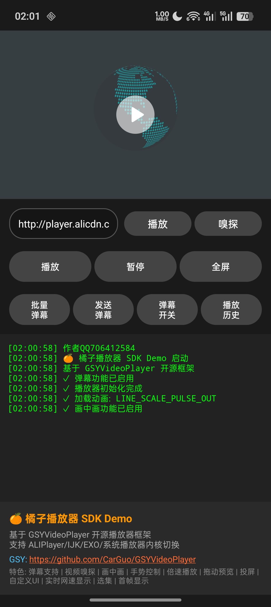
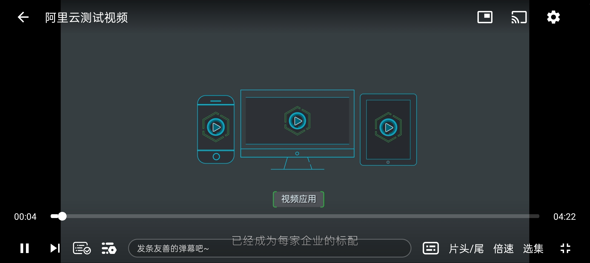
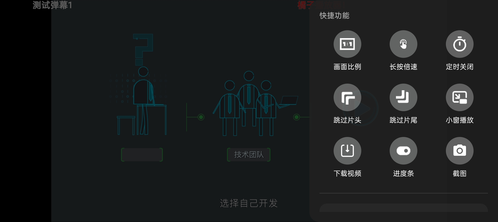
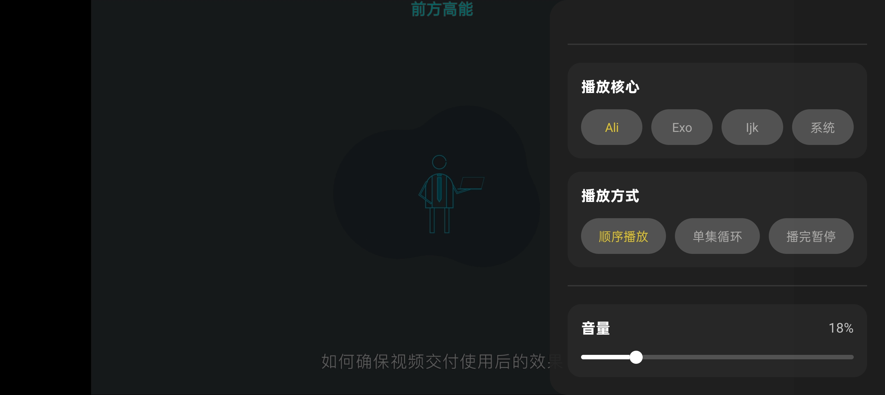
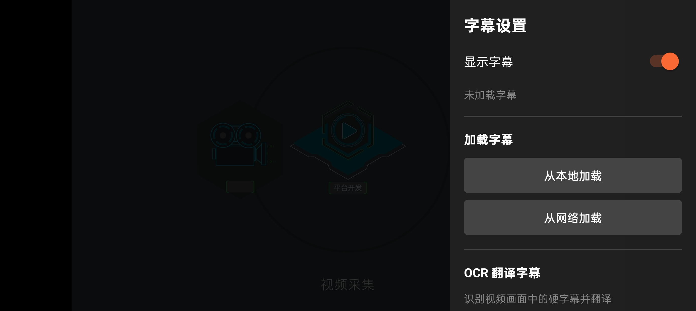
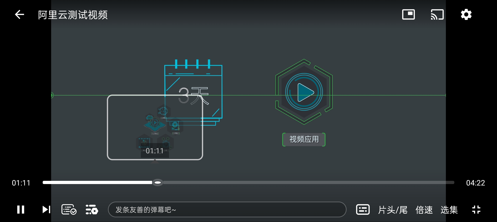

# OrangePlayer 橘子播放器

基于 [GSYVideoPlayer](https://github.com/CarGuo/GSYVideoPlayer) 的增强视频播放器库，提供丰富的播放功能和自定义控制组件。

[](https://jitpack.io/#706412584/orangeplayer)
[](https://github.com/706412584/orangeplayer/actions/workflows/android.yml)

📱 [下载 Demo APK](https://github.com/706412584/orangeplayer/releases/tag/demo)

## 截图预览

<p align="center">
  
  
  
</p>
<p align="center">
  
  
  
</p>

## 功能特性

| 功能 | 说明 |
|------|------|
| 🎬 多播放内核 | 系统/ExoPlayer/IJK/阿里云，运行时切换 |
| 📝 字幕系统 | SRT/ASS/VTT 格式，大小可调 |
| 🔤 OCR 识别 | Tesseract 硬字幕识别 + ML Kit 翻译 |
| 🎤 语音识别 | Vosk 离线语音识别，实时字幕生成 |
| 💬 弹幕功能 | 大小/速度/透明度可调，支持发送 |
| 🎛️ 倍速播放 | 0.35x - 10x，长按倍速 |
| ⏰ 定时关闭 | 30/60/90/120 分钟 |
| ⏭️ 跳过片头尾 | 0-300 秒可调 |
| 📺 投屏 | DLNA 投屏支持 |
| 🖼️ 画中画 | PiP 小窗模式 |
| 📸 截图 | 视频截图保存 |

---

## 快速开始

### 1. 添加仓库

```gradle
// settings.gradle
dependencyResolutionManagement {
    repositories {
        google()
        mavenCentral()
        maven { url 'https://jitpack.io' }
        // 阿里云播放器仓库（如需使用阿里云内核）
        maven { url 'https://maven.aliyun.com/repository/releases' }
    }
}
```

### 2. 添加依赖

⚠️ **重要**：OrangePlayer 基于 GSYVideoPlayer，必须同时添加 GSY 的基础依赖，否则会报 `NoClassDefFoundError`！

#### 最小依赖配置（仅系统播放器）

**方案一：支持传递依赖的构建工具（推荐）**

如果你的构建工具支持自动解析传递依赖（如 Gradle、Maven），只需添加：

```gradle
// app/build.gradle
dependencies {
    // OrangePlayer 核心库
    implementation 'com.github.706412584:orangeplayer:v1.0.3'
    
    // GSY 基础依赖（会自动引入子依赖）
    implementation 'io.github.carguo:gsyvideoplayer-java:11.3.0'
}
```

**方案二：不支持传递依赖的构建工具**

如果你的构建工具不自动解析传递依赖，需要手动添加所有子依赖：

```gradle
// app/build.gradle
dependencies {
    // OrangePlayer 核心库
    implementation 'com.github.706412584:orangeplayer:v1.0.3'
    
    // GSY 基础依赖
    implementation 'io.github.carguo:gsyvideoplayer-java:11.3.0'
    
    // GSY 子依赖（手动添加）
    implementation 'io.github.carguo:gsyvideoplayer-base:11.3.0'
    implementation 'io.github.carguo:gsyvideoplayer-androidvideocache:11.3.0'
    implementation 'io.github.carguo:gsyijkjava:1.0.0'
}
```

> **依赖说明：**
> - `gsyvideoplayer-java` - GSY 主模块
> - `gsyvideoplayer-base` - 包含 `BasePlayerManager` 等核心类
> - `gsyvideoplayer-androidvideocache` - 视频缓存功能（gsyvideoplayer-java 依赖它）
> - `gsyijkjava` - IJK 接口层（约 50KB，不含 so 库，所有播放器都需要）

#### 推荐配置（ExoPlayer）

如果使用 ExoPlayer（推荐，格式支持更全）：

```gradle
// app/build.gradle
dependencies {
    // OrangePlayer 核心库
    implementation 'com.github.706412584:orangeplayer:v1.0.3'
    
    // GSY 基础依赖
    implementation 'io.github.carguo:gsyvideoplayer-java:11.3.0'
    
    // ExoPlayer 播放内核
    implementation 'io.github.carguo:gsyvideoplayer-exo2:11.3.0'
    
    // 如果构建工具不支持传递依赖，还需要手动添加：
    // implementation 'io.github.carguo:gsyvideoplayer-base:11.3.0'
    // implementation 'io.github.carguo:gsyvideoplayer-androidvideocache:11.3.0'
    // implementation 'io.github.carguo:gsyijkjava:1.0.0'
    // implementation 'androidx.media3:media3-exoplayer:1.8.0'
    // implementation 'androidx.media3:media3-ui:1.8.0'
}
```

#### 其他播放内核（可选）

```gradle
dependencies {
    // 阿里云播放器模式（需要 License）
    implementation 'io.github.carguo:gsyvideoplayer-aliplay:11.3.0'
    
    // IJK 播放器 so 库（根据需要选择 CPU 架构）
    implementation 'io.github.carguo:gsyvideoplayer-arm64:11.3.0'   // arm64-v8a
    implementation 'io.github.carguo:gsyvideoplayer-armv7a:11.3.0'  // armeabi-v7a
}
```

#### 更多格式支持（可选）

如需支持 MPEG 编码、RTSP、concat、crypto 协议等，添加扩展 so 库：

```gradle
dependencies {
    // 扩展编码支持（支持 mpeg 编码和更多协议，支持 16k Page Size）
    // 注意：会增加包体积
    implementation 'io.github.carguo:gsyvideoplayer-ex_so:11.3.0'
}
```

> **说明**：普通版本支持 H.263/H.264/H.265 等常见编码，对于 MPEG 编码可能出现有声音无画面的情况。`ex_so` 扩展库补充了 MPEG 编码和更多协议支持。

### 3. AndroidManifest.xml 配置

```xml
<?xml version="1.0" encoding="utf-8"?>
<manifest xmlns:android="http://schemas.android.com/apk/res/android"
          xmlns:tools="http://schemas.android.com/tools">
    
    <!-- 允许使用 minSdk 24 的投屏库 -->
    <uses-sdk tools:overrideLibrary="com.uaoanlao.tv" />
    
    <!-- 网络权限（必需）-->
    <uses-permission android:name="android.permission.INTERNET" />
    <uses-permission android:name="android.permission.ACCESS_NETWORK_STATE" />
    
    <!-- 投屏需要的 WiFi 权限（可选，投屏功能需要）-->
    <uses-permission android:name="android.permission.ACCESS_WIFI_STATE" />
    <uses-permission android:name="android.permission.CHANGE_WIFI_MULTICAST_STATE" />
    
    <application
        android:usesCleartextTraffic="true"
        ... >
        
        <!-- Activity 配置（支持横竖屏切换和画中画）-->
        <activity
            android:name=".YourActivity"
            android:configChanges="screenSize|smallestScreenSize|screenLayout|orientation|keyboardHidden"
            android:supportsPictureInPicture="true"
            android:resizeableActivity="true">
        </activity>
    </application>
</manifest>
```

**关键配置说明：**

| 配置项 | 说明 |
|--------|------|
| `usesCleartextTraffic="true"` | 允许 HTTP 明文流量（播放 HTTP 视频源需要）|
| `configChanges` | 防止横竖屏切换时 Activity 重建 |
| `supportsPictureInPicture` | 启用画中画模式 |
| `resizeableActivity` | 允许调整窗口大小 |

### 4. 基本使用

#### 方式一：自动初始化（推荐）

OrangePlayer 会自动创建和配置控制器，无需手动设置：

```xml
<!-- 布局文件 -->
<com.orange.playerlibrary.OrangevideoView
    android:id="@+id/video_player"
    android:layout_width="match_parent"
    android:layout_height="200dp" />
```

```java
// Activity 中
import com.orange.playerlibrary.OrangevideoView;

OrangevideoView videoView = findViewById(R.id.video_player);
videoView.setUp("https://example.com/video.mp4", true, "视频标题");
videoView.startPlayLogic();
```

#### 方式二：自定义控制器（高级）

如果需要自定义控制器，可以手动创建并设置：

```java
import com.orange.playerlibrary.OrangevideoView;
import com.orange.playerlibrary.OrangeVideoController;

OrangevideoView videoView = findViewById(R.id.video_player);

// 创建自定义控制器
OrangeVideoController controller = new OrangeVideoController(this);
// 自定义控制器配置...

// 设置控制器（可选）
videoView.setVideoController(controller);

// 设置视频
videoView.setUp("https://example.com/video.mp4", true, "视频标题");
videoView.startPlayLogic();
```

> **注意**：大多数情况下不需要手动设置控制器，OrangePlayer 会自动创建并配置好所有组件。

---

## 播放内核切换

OrangePlayer 支持 4 种播放内核，可在运行时动态切换。

### 内核对比

| 内核 | 优点 | 缺点 | 适用场景 |
|------|------|------|------|
| 系统 (MediaPlayer) | 无需额外依赖，兼容性好 | 格式支持有限 | 普通 MP4 播放 |
| ExoPlayer | Google 官方，格式支持全 | 包体积较大 | 推荐默认使用 |
| IJK | 格式支持最全，软解能力强 | 包体积大 | 特殊格式视频 |
| 阿里云 | 性能好，支持私有协议 | 需要 License | 商业项目 |

### 切换方法

```java
import com.orange.playerlibrary.OrangevideoView;
import com.orange.playerlibrary.PlayerConstants;

// 切换到系统播放器
videoView.selectPlayerFactory(PlayerConstants.ENGINE_DEFAULT);

// 切换到 ExoPlayer（推荐）
videoView.selectPlayerFactory(PlayerConstants.ENGINE_EXO);

// 切换到 IJK 播放器
videoView.selectPlayerFactory(PlayerConstants.ENGINE_IJK);

// 切换到阿里云播放器
videoView.selectPlayerFactory(PlayerConstants.ENGINE_ALI);
```

### IJK 内核集成

IJK 内核需要额外添加 so 库依赖：

```gradle
dependencies {
    // IJK 播放器 so 库（按需添加对应 CPU 架构）
    implementation 'io.github.carguo:gsyvideoplayer-arm64:11.3.0'   // arm64-v8a（推荐）
    implementation 'io.github.carguo:gsyvideoplayer-armv7a:11.3.0'  // armeabi-v7a
    implementation 'io.github.carguo:gsyvideoplayer-armv5:11.3.0'   // armeabi（旧设备）
    implementation 'io.github.carguo:gsyvideoplayer-x86:11.3.0'     // x86 模拟器
    implementation 'io.github.carguo:gsyvideoplayer-x64:11.3.0'     // x86_64 模拟器
    
    // 如需更多编码格式支持（mpeg、rtsp、concat、crypto 协议）
    implementation 'io.github.carguo:gsyvideoplayer-ex_so:11.3.0'
}
```

> **注意**：`gsyijkjava` 是 IJK 的 Java 接口层（约 50KB），所有播放器都需要。上面的 so 库才是真正的 IJK 播放器（每个约 10-15MB），只有使用 IJK 内核时才需要添加。

---

## ⚠️ 阿里云内核注意事项

### License 问题

阿里云播放器从 **5.4.0 版本开始需要 License 授权**，否则会出现：
- 播放黑屏
- 水印覆盖
- 功能受限

### 解决方案

**方案一：使用免授权版本（推荐测试使用）**

本库默认使用 5.4.7.1 版本，需要在阿里云控制台申请免费 License。

**方案二：申请 License**

1. 登录 [阿里云视频点播控制台](https://vod.console.aliyun.com/)
2. 创建应用获取 License
3. 在 Application 中初始化：

```java
import com.aliyun.player.AliPlayerFactory;

public class MyApplication extends Application {
    @Override
    public void onCreate() {
        super.onCreate();
        // 初始化阿里云播放器 License
        AliPlayerFactory.setLicenseKey("your_license_key");
    }
}
```

**方案三：使用旧版本（5.3.0 免授权）**

```gradle
// 排除默认的阿里云 SDK
implementation ('com.github.706412584:orangeplayer:v1.0.1') {
    exclude group: 'com.aliyun.sdk.android', module: 'AliyunPlayer'
}

// 使用 5.3.0 免授权版本
implementation 'com.aliyun.sdk.android:AliyunPlayer:5.3.0-full'
```

### 阿里云仓库配置

```gradle
// settings.gradle
repositories {
    maven { url 'https://maven.aliyun.com/repository/releases' }
    maven { url 'https://maven.aliyun.com/repository/public' }
}
```

---

## 投屏功能集成

投屏功能使用 DLNA 协议，需要额外添加依赖。

### 添加依赖

```gradle
dependencies {
    // DLNA 投屏库
    implementation 'com.github.AnyListen:UaoanDLNA:1.0.1'
    
    // 投屏库依赖
    implementation 'com.squareup.okhttp3:okhttp:4.12.0'
    implementation 'com.squareup.okio:okio:3.6.0'
}
```

### 使用方法

```java
import com.orange.playerlibrary.cast.DLNACastManager;

// 检查投屏是否可用
if (DLNACastManager.isDLNAAvailable()) {
    // 开始投屏（会弹出设备选择界面）
    DLNACastManager.getInstance().startCast(
        activity,           // Activity
        videoUrl,           // 视频地址
        "视频标题"          // 标题
    );
}

// 监听投屏状态
DLNACastManager.getInstance().setOnCastStateListener(new DLNACastManager.OnCastStateListener() {
    @Override
    public void onCastStarted() {
        // 投屏开始
    }
    
    @Override
    public void onCastStopped() {
        // 投屏停止
    }
    
    @Override
    public void onCastError(String message) {
        // 投屏错误
    }
});
```

---

## 语音识别字幕

OrangePlayer 支持使用 Vosk 离线语音识别引擎，实时识别视频音频并生成字幕。

### 系统要求

- **Android 10 (API 29) 或更高版本**
- 原因：使用 AudioPlaybackCapture API 捕获应用内音频

### 添加依赖

```gradle
dependencies {
    // Vosk 离线语音识别
    implementation 'com.alphacephei:vosk-android:0.3.47'
}
```

### 下载语音模型

Vosk 需要语言模型文件才能工作。模型文件需要放在应用的 `assets` 目录或外部存储。

#### 推荐模型

| 语言 | 模型名称 | 大小 | 下载地址 |
|------|---------|------|---------|
| 中文 | vosk-model-small-cn | ~42 MB | [下载](https://alphacephei.com/vosk/models/vosk-model-small-cn-0.22.zip) |
| 英语 | vosk-model-small-en-us | ~40 MB | [下载](https://alphacephei.com/vosk/models/vosk-model-small-en-us-0.15.zip) |
| 日语 | vosk-model-small-ja | ~48 MB | [下载](https://alphacephei.com/vosk/models/vosk-model-small-ja-0.22.zip) |

更多语言模型请访问：https://alphacephei.com/vosk/models

#### 模型放置位置

**方式一：放在 assets 目录（推荐）**

```
app/src/main/assets/
└── vosk-model-small-cn/
    ├── am/
    ├── conf/
    ├── graph/
    └── ...
```

**方式二：运行时下载到外部存储**

```java
// 下载并解压模型到 /sdcard/Android/data/your.package/files/vosk-models/
File modelDir = new File(context.getExternalFilesDir(null), "vosk-models/vosk-model-small-cn");
```

### 使用方法

```java
import com.orange.playerlibrary.speech.VoskSpeechEngine;
import com.orange.playerlibrary.VideoEventManager;

// 检查 Vosk SDK 是否可用
if (com.orange.playerlibrary.speech.VoskAvailabilityChecker.isVoskAvailable()) {
    // 通过播放器 UI 启动语音识别
    // 用户点击字幕按钮 -> 语音识别翻译 -> 选择语言 -> 开始识别
    
    // 或者通过代码启动
    VideoEventManager eventManager = videoView.getEventManager();
    eventManager.startSpeechTranslate();
} else {
    // 提示用户安装 Vosk SDK
    Toast.makeText(context, "需要安装 Vosk SDK", Toast.LENGTH_SHORT).show();
}
```

### 权限说明

语音识别功能**不需要麦克风权限**，因为使用的是 AudioPlaybackCapture API 捕获应用内音频。

但首次使用时会弹出系统权限对话框：

```
是否允许橘子播放器开始录制或投放？
- 整个屏幕
- 此应用
```

这是 Android 系统的 MediaProjection 权限，用于捕获应用内音频，**无法绕过**。

### 功能特点

- ✅ **离线识别**：无需网络连接
- ✅ **实时字幕**：识别结果实时显示
- ✅ **自动清理**：字幕超过 25 字符自动清空
- ✅ **多语言支持**：支持中文、英语、日语等多种语言
- ⚠️ **倍速限制**：倍速播放会降低识别准确率（模型使用正常语速训练）

### 注意事项

1. **首次启动较慢**：加载模型需要 2-5 秒
2. **内存占用**：模型会占用约 50-100 MB 内存
3. **识别准确率**：
   - 正常语速：85-95%
   - 1.5x 倍速：70-80%
   - 2.0x 倍速：50-60%
4. **不支持实时翻译**：当前版本仅支持识别，不支持翻译

### 故障排查

**问题：识别不准确**
- 确保使用正确的语言模型
- 降低播放倍速
- 检查音频质量

**问题：无法启动识别**
- 检查 Android 版本是否 >= 10
- 检查模型文件是否正确放置
- 查看 Logcat 日志

**问题：识别延迟**
- 正常延迟 1-2 秒
- 如果延迟过长，检查设备性能

---

## OCR 字幕翻译

OrangePlayer 支持识别视频画面中的硬字幕（嵌入在视频中的字幕），并使用 ML Kit 进行翻译。

### 添加依赖

```gradle
dependencies {
    // OCR 文字识别
    implementation 'cz.adaptech.tesseract4android:tesseract4android:4.7.0'
    
    // 文字翻译
    implementation 'com.google.mlkit:translate:17.0.2'
}
```

### 语言包

语言包文件位于 `tessdata_packs/` 目录，复制到 `assets/tessdata/` 或使用应用内下载。

| 语言 | 文件 | 大小 |
|------|------|------|
| 简体中文 | chi_sim.traineddata | 2.35 MB |
| 繁体中文 | chi_tra.traineddata | 2.26 MB |
| 英语 | eng.traineddata | 3.92 MB |
| 日语 | jpn.traineddata | 2.36 MB |
| 韩语 | kor.traineddata | 1.60 MB |

### 使用方法

```java
import com.orange.playerlibrary.ocr.LanguagePackManager;

// 检查语言包是否已安装
LanguagePackManager manager = new LanguagePackManager(context);
if (manager.isLanguageInstalled("chi_sim")) {
    // 已安装简体中文
}

// 下载语言包
manager.downloadLanguage("eng", new LanguagePackManager.DownloadCallback() {
    @Override
    public void onProgress(int progress, long downloaded, long total) {
        // 下载进度
    }
    
    @Override
    public void onSuccess() {
        // 下载成功
    }
    
    @Override
    public void onError(String error) {
        // 下载失败
    }
});
```

### 使用方法

```java
import com.orange.playerlibrary.ocr.OcrAvailabilityChecker;

// 检查 OCR 功能是否可用
if (OcrAvailabilityChecker.isOcrTranslateAvailable()) {
    // 通过播放器 UI 启动 OCR
    // 用户点击字幕按钮 -> OCR 翻译字幕 -> 设置识别区域 -> 选择语言 -> 开始识别
} else {
    // 提示用户安装依赖
    String message = OcrAvailabilityChecker.getMissingDependenciesMessage();
    Toast.makeText(context, message, Toast.LENGTH_LONG).show();
}
```

### 功能特点

- ✅ **硬字幕识别**：识别嵌入在视频中的字幕
- ✅ **实时翻译**：使用 ML Kit 翻译识别结果
- ✅ **区域选择**：可自定义识别区域
- ✅ **多语言支持**：支持中文、英语、日语、韩语等
- ⚠️ **性能影响**：OCR 识别会占用较多 CPU 资源

---

## 语音识别 vs OCR 对比

| 功能 | 语音识别 | OCR 识别 |
|------|---------|---------|
| 识别对象 | 视频音频 | 视频画面字幕 |
| 系统要求 | Android 10+ | Android 5.0+ |
| 网络要求 | 离线 | 离线（首次需下载模型）|
| 准确率 | 85-95% | 70-90% |
| 性能影响 | 中等 | 较高 |
| 倍速影响 | 较大 | 无影响 |
| 适用场景 | 无字幕视频 | 硬字幕视频 |

---

## 完整依赖配置示例

### 标准配置（推荐）

适用于支持传递依赖解析的构建工具（Gradle、Maven）：

```gradle
// app/build.gradle
dependencies {
    // OrangePlayer 核心库
    implementation 'com.github.706412584:orangeplayer:1.0.3'
    
    // === GSY 基础依赖（必需）===
    implementation 'io.github.carguo:gsyvideoplayer-java:11.3.0'
    
    // === 播放内核（按需选择）===
    
    // ExoPlayer 模式（推荐）
    implementation 'io.github.carguo:gsyvideoplayer-exo2:11.3.0'
    
    // 阿里云播放器模式（需要 License）
    implementation 'io.github.carguo:gsyvideoplayer-aliplay:11.3.0'
    
    // IJK 播放器 so 库（根据目标设备选择）
    implementation 'io.github.carguo:gsyvideoplayer-arm64:11.3.0'
    implementation 'io.github.carguo:gsyvideoplayer-armv7a:11.3.0'
    
    // 扩展编码支持（mpeg、rtsp、concat、crypto 协议）
    // implementation 'io.github.carguo:gsyvideoplayer-ex_so:11.3.0'
    
    // === 可选功能 ===
    
    // DLNA 投屏
    implementation 'com.github.AnyListen:UaoanDLNA:1.0.1'
    implementation 'com.squareup.okhttp3:okhttp:4.12.0'
    
    // OCR 字幕识别与翻译
    implementation 'cz.adaptech.tesseract4android:tesseract4android:4.7.0'
    implementation 'com.google.mlkit:translate:17.0.2'
    
    // 语音识别（需要 Android 10+）
    implementation 'com.alphacephei:vosk-android:0.3.47'
}
```

### 完整配置（手动传递依赖）

适用于不支持传递依赖解析的构建工具，需要手动添加所有子依赖：

```gradle
// app/build.gradle
dependencies {
    // OrangePlayer 核心库
    implementation 'com.github.706412584:orangeplayer:1.0.3'
    
    // === GSY 基础依赖（必需）===
    implementation 'io.github.carguo:gsyvideoplayer-java:11.3.0'
    
    // GSY 子依赖（手动添加）
    implementation 'io.github.carguo:gsyvideoplayer-androidvideocache:11.3.0'
    implementation 'io.github.carguo:gsyvideoplayer-base:11.3.0'
    implementation 'io.github.carguo:gsyijkjava:1.0.0'
    
    // === 播放内核（按需选择）===
    
    // ExoPlayer 模式（推荐）
    implementation 'io.github.carguo:gsyvideoplayer-exo2:11.3.0'
    implementation 'androidx.media3:media3-exoplayer:1.8.0'
    implementation 'androidx.media3:media3-ui:1.8.0'
    implementation 'androidx.media3:media3-common:1.8.0'
    
    // 阿里云播放器模式（需要 License）
    implementation 'io.github.carguo:gsyvideoplayer-aliplay:11.3.0'
    
    // IJK 播放器 so 库（根据目标设备选择）
    implementation 'io.github.carguo:gsyvideoplayer-arm64:11.3.0'
    implementation 'io.github.carguo:gsyvideoplayer-armv7a:11.3.0'
    
    // 扩展编码支持（mpeg、rtsp、concat、crypto 协议）
    // implementation 'io.github.carguo:gsyvideoplayer-ex_so:11.3.0'
    
    // === AndroidX 基础库（通常已包含）===
    implementation 'androidx.appcompat:appcompat:1.7.1'
    implementation 'androidx.annotation:annotation:1.6.0'
    implementation 'androidx.core:core:1.13.0'
    
    // === 可选功能 ===
    
    // DLNA 投屏
    implementation 'com.github.AnyListen:UaoanDLNA:1.0.1'
    implementation 'com.squareup.okhttp3:okhttp:4.12.0'
    implementation 'com.squareup.okio:okio:3.6.0'
    
    // OCR 字幕识别与翻译
    implementation 'cz.adaptech.tesseract4android:tesseract4android:4.7.0'
    implementation 'com.google.mlkit:translate:17.0.2'
    
    // 语音识别（需要 Android 10+）
    implementation 'com.alphacephei:vosk-android:0.3.47'
}
```

---

## 常见问题

### 1. NoClassDefFoundError: BasePlayerManager

**错误信息：**
```
java.lang.NoClassDefFoundError: Failed resolution of: Lcom/shuyu/gsyvideoplayer/player/BasePlayerManager
```

**原因：** 缺少 GSYVideoPlayer 基础依赖或子依赖

**解决方案：** 在 `app/build.gradle` 中添加完整依赖：

**方案一：仅使用系统播放器（最小依赖）**

```gradle
dependencies {
    // OrangePlayer 核心库
    implementation 'com.github.706412584:orangeplayer:v1.0.1'
    
    // GSY 最小依赖（系统播放器必需）
    implementation 'io.github.carguo:gsyvideoplayer-java:11.3.0'
    implementation 'io.github.carguo:gsyvideoplayer-base:11.3.0'
    implementation 'io.github.carguo:gsyvideoplayer-androidvideocache:11.3.0'
    implementation 'io.github.carguo:gsyijkjava:1.0.0'
}
```

**方案二：使用 ExoPlayer（推荐）**

```gradle
dependencies {
    // OrangePlayer 核心库
    implementation 'com.github.706412584:orangeplayer:v1.0.1'
    
    // GSY 基础依赖（必需！）
    implementation 'io.github.carguo:gsyvideoplayer-java:11.3.0'
    
    // GSY 子依赖（如果构建工具不自动解析传递依赖）
    implementation 'io.github.carguo:gsyvideoplayer-androidvideocache:11.3.0'
    implementation 'io.github.carguo:gsyvideoplayer-base:11.3.0'
    implementation 'io.github.carguo:gsyijkjava:1.0.0'
    
    // ExoPlayer 播放内核
    implementation 'io.github.carguo:gsyvideoplayer-exo2:11.3.0'
    
    // ExoPlayer 依赖（Media3）
    implementation 'androidx.media3:media3-exoplayer:1.8.0'
    implementation 'androidx.media3:media3-ui:1.8.0'
}
```

### 2. 播放黑屏或无声音

**可能原因：**
- 视频编码格式不支持
- 播放内核不兼容

**解决方案：**
1. 尝试切换播放内核（系统/ExoPlayer/IJK）
2. 如果是 MPEG 编码，添加扩展 so 库：
   ```gradle
   implementation 'io.github.carguo:gsyvideoplayer-ex_so:11.3.0'
   ```

### 3. 阿里云播放器黑屏/水印

**原因：** 阿里云播放器 5.4.0+ 需要 License

**解决方案：** 参考 [阿里云内核注意事项](#️-阿里云内核注意事项) 章节

### 4. 投屏功能不可用

**原因：** 缺少 DLNA 投屏库

**解决方案：**
```gradle
implementation 'com.github.AnyListen:UaoanDLNA:1.0.1'
implementation 'com.squareup.okhttp3:okhttp:4.12.0'
```

### 5. OCR/语音识别按钮显示"查看安装说明"

**原因：** 缺少对应的 SDK 依赖

**解决方案：**
- OCR 功能：参考 [OCR 字幕翻译](#ocr-字幕翻译) 章节
- 语音识别：参考 [语音识别字幕](#语音识别字幕) 章节

### 6. 语音识别无法启动

**可能原因：**
- Android 版本低于 10
- 缺少 Vosk SDK
- 模型文件未正确放置

**解决方案：**
1. 检查 Android 版本：`Build.VERSION.SDK_INT >= 29`
2. 添加依赖：`implementation 'com.alphacephei:vosk-android:0.3.47'`
3. 下载并放置模型文件到 `assets/vosk-model-small-cn/`

---

## API 文档

详细 API 请查看 [docs/API.md](docs/API.md)

## 项目结构

详细结构请查看 [docs/STRUCTURE.md](docs/STRUCTURE.md)

---

## 混淆配置

```proguard
# GSYVideoPlayer
-keep class com.shuyu.gsyvideoplayer.** { *; }
-keep class tv.danmaku.ijk.** { *; }

# OrangePlayer
-keep class com.orange.playerlibrary.** { *; }

# Tesseract OCR
-keep class com.googlecode.tesseract.android.** { *; }

# ML Kit Translation
-keep class com.google.mlkit.** { *; }

# Vosk 语音识别
-keep class org.vosk.** { *; }

# 阿里云播放器
-keep class com.aliyun.player.** { *; }
-keep class com.cicada.player.** { *; }

# DLNA 投屏
-keep class com.uaoanlao.tv.** { *; }
```

---

## License

Apache License 2.0

---

## 作者

**QQ: 706412584**

如有问题或建议，欢迎联系交流。

## 致谢

- [GSYVideoPlayer](https://github.com/CarGuo/GSYVideoPlayer)
- [Tesseract4Android](https://github.com/adaptech-cz/Tesseract4Android)
- [DanmakuFlameMaster](https://github.com/bilibili/DanmakuFlameMaster)
- [UaoanDLNA](https://github.com/AnyListen/UaoanDLNA)
